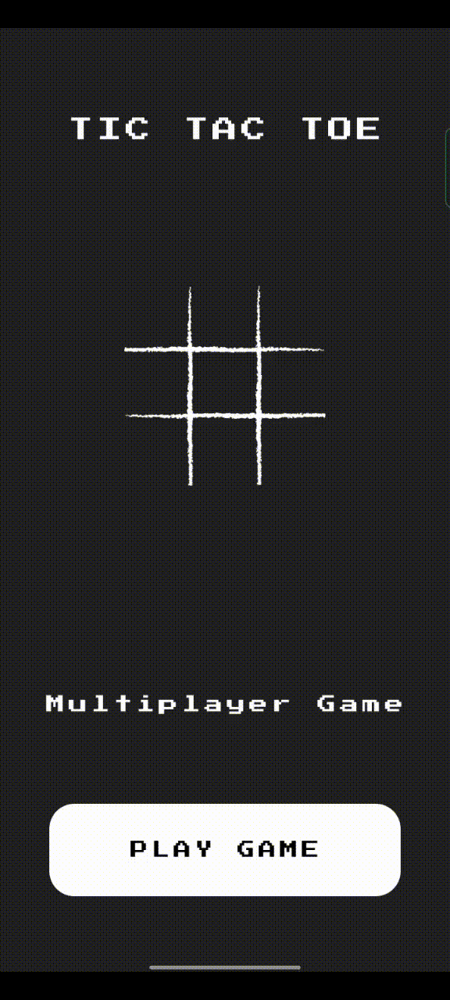
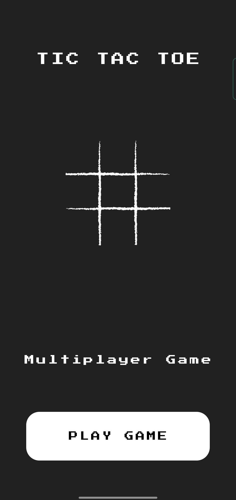
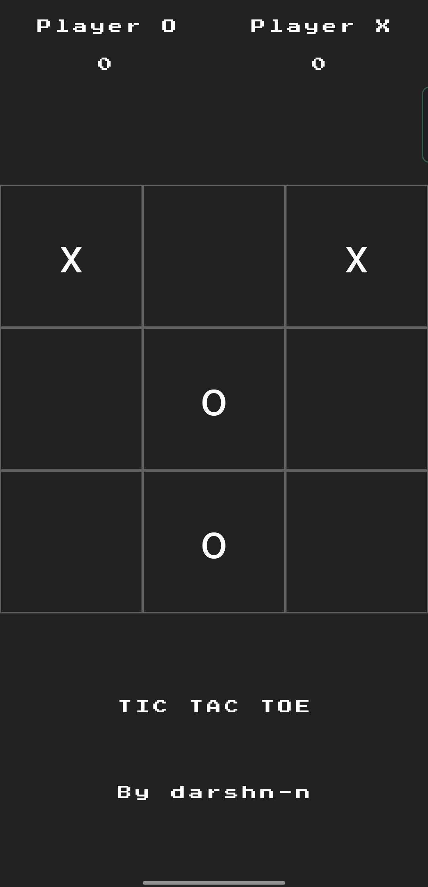

# TicTacToe

A new Flutter project of Multiplayer video game genre.

## Demo



## Installation

You can clone by copy and pasting below commands in your Terminal.

```bash
    git clone https://github.com/darshn-n/tictactoe/
    cd tictactoe
    flutter run
```

App Folder Structure

```
    app
    |
    ├── home_page.dart
    |
    └── main.dart
```

Libraries used in the project

```yaml
cupertino_icons: ^1.0.2
google_fonts: ^3.0.1
avatar_glow: ^2.0.2
```

## Screenshots
 &nbsp;&nbsp;&nbsp; &nbsp;&nbsp;&nbsp;

### That's it

```
	Voila
```
